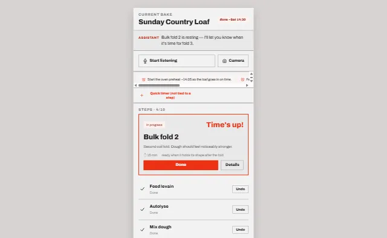

# Baking Companion

A graph-driven, **confirm-only** companion for long bakes (sourdough, focaccia, pizza).
Recipes are DAGs; a live bake is a *marking* over that graph; the timer engine is a
scheduler that plans forward (ETAs) and backward (when to feed the levain, start the
preheat). Runs on a spare Android phone (Termux + the phone's Chrome) — see `docs/` for
the full design.

<p align="center">
  
  <br>
  <em>The live-bake screen, in the “Modernist” design system.</em>
</p>

**Status:** the full app is built and running — the graph engine, two-tier router, live
scheduler, recipe import, and a **phone web UI** (a single-page app with a bottom tab bar,
styled in a design system authored in [Claude Design](https://claude.ai/design)). Voice is
in (manual start/stop); vision, cross-bake memory, and a hosted PWA are the ongoing roadmap
(`docs/04-status.md`, `docs/05-build-plan.md`).

## The app (phone web UI)

Three screens, switched by a bottom tab bar:

- **Current** — the live bake: the active/next step as a hero spotlight, per-step
  **start / done / undo**, live countdown timers + alarm, back-scheduled **prep alerts**
  (feed levain / start preheat), a manual quick timer, expandable step detail
  (ingredients / temp / duration / readiness / references), per-step photo + video capture,
  and optional voice.
- **Bakes** — list / start / switch bake instances (concurrent bakes supported).
- **Recipes** — the library, plus AI recipe import (URL + text + photos → validated YAML)
  and AI-assisted editing.

Bundled recipes seeded on first run: **Sourdough Country Loaf**, **Sourdough Loaf** (plain),
and a **1:6:6 Starter Build**.

## Requirements

Python ≥ 3.10 and **`pyyaml`** — that's the only third-party dependency (the schema is
stdlib `dataclasses`, the LLM client is `urllib`, the web server is `http.server`), so it
installs on a phone without compiling anything. Data lives in `~/.baking_companion/`
(override with `BAKING_HOME`).

## Run

```bash
# from the repo root, no install needed:
python3 -m baking_companion <command>

# or install the `bake` entry point:
pip install -e .
bake serve                  # then open http://localhost:8765 in Chrome
```

## Voice / phone (Termux)

`bake serve` runs a stdlib HTTP server (no FastAPI/uvicorn) and, on the phone, you open
`http://localhost:8765` in Chrome. The browser does STT (`webkitSpeechRecognition`),
TTS (`speechSynthesis`) and camera (`getUserMedia`); the Python backend runs the
FSM/router/scheduler. Served over `localhost` = secure context, so no HTTPS needed.

```bash
pkg install python git
git clone https://github.com/anupamm002/baking-companion.git && cd baking-companion
pip install -e .            # pulls only pyyaml
bake serve                  # open http://localhost:8765 in Chrome
```

## Cloud reasoning

Tier-1 (`bake ask` judgment questions, `bake import`) uses your **OpenRouter** key:

```bash
export OPENROUTER_API_KEY=sk-or-...
export BAKING_LLM_MODEL=anthropic/claude-sonnet-4.6   # optional
```

Without a key, Tier-0 still works fully; Tier-1 questions show the context bundle that
*would* be sent, and `bake import --dry-run` prints the exact prompt.

## CLI

The same engine drives a CLI:

```
bake start <recipe>         create a bake (recipe = ./recipes/<id>.yaml or a path)
bake list                   list bakes
bake use <bake_id>          set the current bake
bake status                 marking + frontier
bake show <node>            full recipe detail for a step (+ past media across bakes)
bake begin <node> [--at T] [--expect 4h30m]
bake done <node> [--at T]
bake skip <node> [--reason ...]
bake capture <node> <file> [--tags a,b] [--caption ...]
bake note <node> <text...>
bake when                   levain-ready, next steps, ETA, prep alerts (preheat/score)
bake timeline               event log
bake ask "<question>"       natural language: routed Tier-0 (local) or Tier-1 (LLM)
bake import <url|photo|txt> [--dry-run]   LLM-assisted recipe import -> validated YAML
bake serve [--host H --port P]            phone web UI + voice backend (localhost)
```

State advances **only** on your confirmation (`begin`/`done`); timers and readiness hints
are advisory. Timing drift (45 min instead of 30) just re-flows the schedule.
